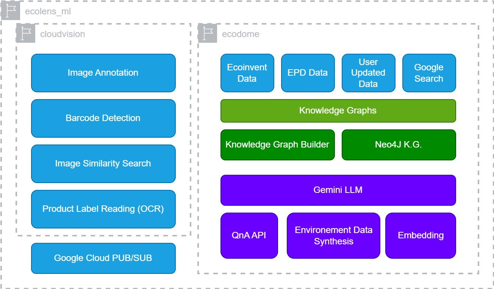

# EcoLens Machine Learning

## Overview

EcoLens Machine Learning  is a project that integrates advanced machine learning techniques into the EcoLens platform. The goal is to elevate its capabilities in providing real-time, personalized, and accurate information on the environmental impact of products.

## Key Objectives

1. **Image Recognition Improvement:**
   - Implement state-of-the-art machine learning models for accurate and efficient product image recognition through the Google Lens integration.

2. **Sustainability Rating Predictions:**
   - Develop models to predict sustainability ratings for products based on various factors, enhancing the accuracy of environmental impact assessments.

3. **User Behavior Analysis and Personalization:**
   - Utilize machine learning algorithms to analyze user interactions within the EcoLens application, providing personalized recommendations for users.

4. **Dynamic Prioritization of Local Businesses:**
   - Implement machine learning to dynamically prioritize local businesses with sustainable practices based on real-time data and user preferences.

5. **Enhanced Supply Chain Transparency:**
   - Develop models to analyze and improve the transparency of supply chains, predicting and identifying potential environmental impacts.

6. **Natural Language Processing for Information Extraction:**
   - Apply NLP techniques to extract valuable information from textual data, enriching the dataset used for sustainability analysis.

7. **Continuous Learning and Model Updates:**
   - Establish a system for continuous learning, ensuring machine learning models are regularly updated based on new data and user interactions.

## Technical Architecture

**Components**

* **ecolens_ml** 
   * **Purpose:**  Houses machine learning (ML) models and associated logic.  
   * **Technologies:** Cloud Run, AI Platform, PyTorch
   * **Functions:** Image Label Recognition, Product Classification (if eco-focused), Predictive Analytics, Data augmentation and generation.

* **cloudvision** (Google Cloud Vision API)
   * **Purpose:** Extracts text from product labels using optical character recognition (OCR)
   * **Functions:** Image classification, OCR (text recognition) etc.

* **ecodome** (Heavy Stuff)

   **Components of Ecodome**

   * **Google Search**
      * **Purpose:** Integrates with Google's search capabilities, allowing users to search within the system's data or potentially leveraging broader web search results.

   * **Image Similarity Search**
      * **Purpose:** Leverages Google Lens's Image Searching capabilities through SerpAPI. To find images similar to a user uploaded image.

   * **Gemini LLM**
      * **Purpose:** Integrates with a large language model (LLM), Google's Gemini Pro. This unlocks advanced language understanding and text-based interactions.

   * **Knowledge Engine**
      * **Purpose:** To construct and manage a knowledge graph. This structured representation of data enhances search and information retrieval.
      
   * **QnA API**
      * **Purpose:**  Provides a question-answering interface powered by the knowledge base and LLM capabilities. Users can ask natural language questions.

   * **Environment Data Synthesis**
      * **Purpose:**  Aggregates and processes environmental data from sources like Google Search and EPDs, potentially generating insights and enhancing Knowledge

* **EPD Data**
   * **Purpose:** Stores Environmental Product Declarations (EPDs) used to communicate the environmental performance of products and materials.

* **Google Cloud PUB/SUB**
   * **Purpose:** A messaging service enabling asynchronous communication and decoupling of microservices.

## Datasets

For training and validation, the following types of datasets are used:

- **Product Image Recognition:** Open Images Dataset, ImageNet.
- **Sustainability Rating Predictions:** EcoLabel Index.
- **User Behavior Analysis:** E-commerce User Behavior Dataset.
- **Local Business Focus:** Local Business Directories.
- **Supply Chain Transparency:** Open Food Facts.
- **NLP for Information Extraction:** Product Descriptions and Reviews Datasets.
- **Continuous Learning:** Real-time Sustainability Data Feeds.
